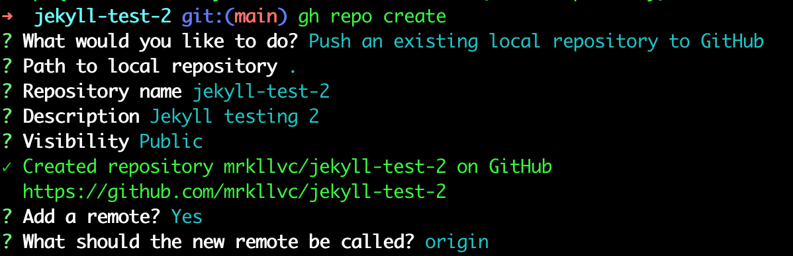
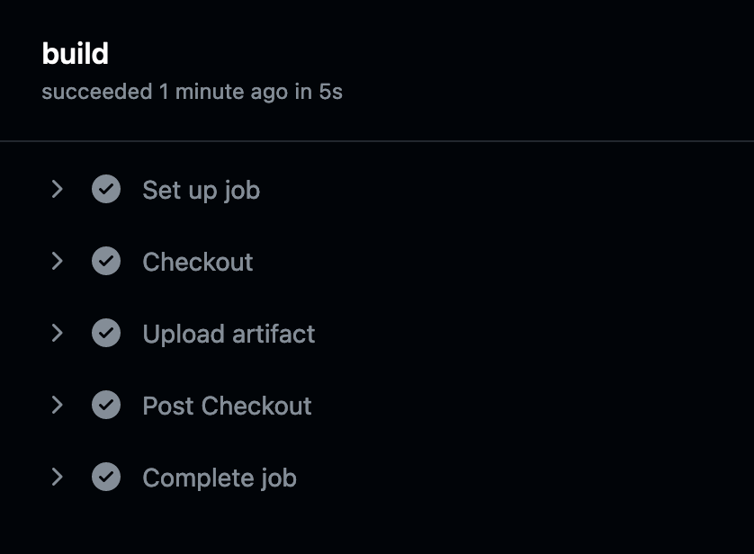

  
# How-to
Build Jekyll site locally and push source code and site to separate branches: main and gh-pages on GitHub. Mainly following the answer [here](https://stackoverflow.com/a/28252200).

Initialize the repository and jekyll code base:
```bash
$ mkdir jekyll-test && cd jekyll-test
$ git init --initial-branch=main
$ git remote add origin git@github.com:<user-name>/jekyll-test.git
$ jekyll new .
```

Set `baseurl: '/jekyll-test'` in `_config.yml`. Add `_site` to `.gitignore`, because the site will be versioned in separate gh-pages branch. Next, run:
```bash
$ jekyll build
$ bundle exec jekyll serve
```
to build the site and serve it locally at: `http://127.0.0.1:4000/jekyll-test/`.

Add the local repository to GitHub:
```bash
($ git init -b main)
$ git add .
$ git commit -m "jekyll source"
$ gh repo create
```


Push Jekyll source to main branch:
```bash
$ git push origin main
```

Push the site to gh-pages branch:
```bash
$ cd _site
$ touch .nojekyll
$ git init
$ git branch -m gh-pages
$ git remote add origin git@github.com:<user-name>/jekyll-test.git
$ git checkout -b gh-pages
$ git add -A
$ git commit -m "jekyll first build"
$ git push origin gh-pages
```

Wait for the site to deploy and check `Settings/Pages`: "Your site is live at https://<user-name>.github.io/jekyll-test/".


