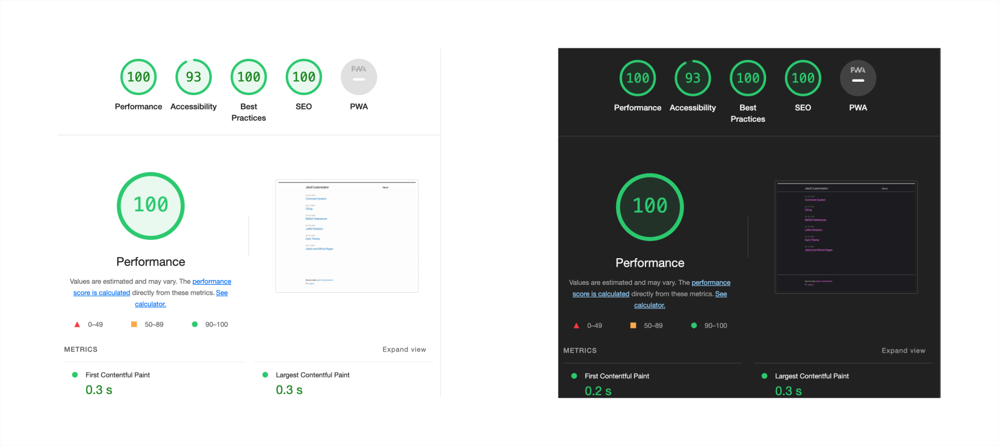

# jekyll-customization

This repository contains some instructions on how to customize a Jekyll website or blog in order to:

- use custom plugins with GitHub pages;

- enable dark mode and set the dark theme;

- enable MathJax for LaTeX notation;

- incorporate BibTeX references and citing using .bib files;

- develop a simple comment system for Jekyll blog via contact forms.

This is achived by starting from an initial Jekyll code base and adding new features that are needed. 

Lighthouse performance insights for the final site with all the features listed above:

For more information, check the source code or the website: [jekyll-customization](https://mrkllvc.github.io/jekyll-customization/). You can also leave a comment under posts.
